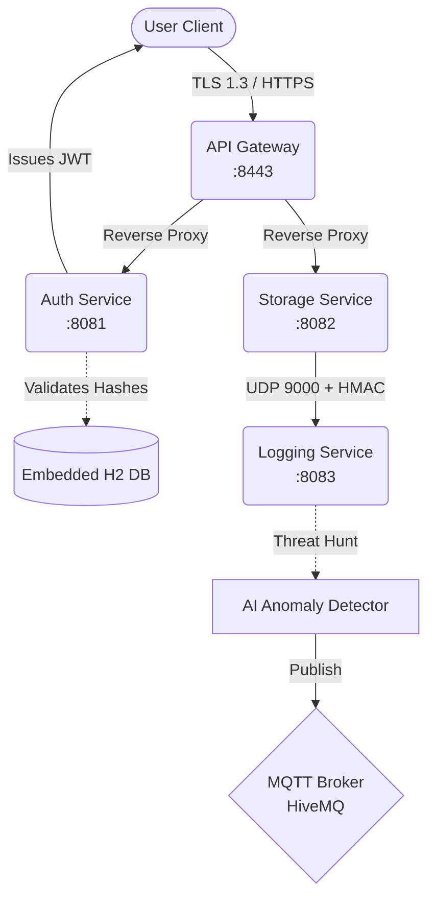

# Secure Microservices File Vault

  

A proof-of-concept, highly concurrent, distributed file storage ecosystem built securely on **Java 21**, **Spring Boot**, and **Virtual Threads**. Designed natively with a strict **Zero-Trust** security posture, the project leverages stateless Web Tokens (JWT), cryptographic HMAC Datagram validation, and real-time AI-simulated quarantine capabilities over IoT protocols.

## 🏗️ Architecture



## 🔒 Security Posture
- **Zero-Trust Boundaries:** All explicit inter-service and external communication points strictly mandate presentation of an HS256 JWT, verified independently by each service without shared persistence.
- **Embedded SSL/TLS 1.3:** The entrypoint (API Gateway) automatically decrypts PKCS12 self-signed certificates to execute reverse-proxying.
- **Stateless Validation:** Total eradication of Server-Side Session caching completely neutralizes all Cross-Site Request Forgery (CSRF) vectors. 
- **HMAC Network Signing:** Log streams emitted by the Storage layer appended with symmetric cryptographic signatures to actively thwart UDP spoofing and DoS flood vectors.
- **Environment Isolation:** Absolutely 0 secrets persist loosely within the byte code or repository index.

## 🚀 Environment Dependencies
To execute this network, ensure the system environment is properly parameterized prior to startup:
```bash
# Bash
export JWT_SECRET="your_cryptographically_secure_256_bit_generated_secret"
export VAULT_KEYSTORE_PASSWORD="your_keystore_password"

# PowerShell
$env:JWT_SECRET="your_cryptographically_secure_256_bit_generated_secret"
$env:VAULT_KEYSTORE_PASSWORD="your_keystore_password"
```

## 💻 Tech Stack
- **Languages:** Java 21 
- **Frameworks:** Spring Boot 3.2.4 (Web, Security, Gateway, Data JPA)
- **Protocols:** REST (HTTPS), UDP (Datagrams), IoT (MQTT v3)
- **Concurrency:** Native OS-Virtual Thread Scheduling 
- **Security:** JJWT, BCrypt, HMAC-SHA256
