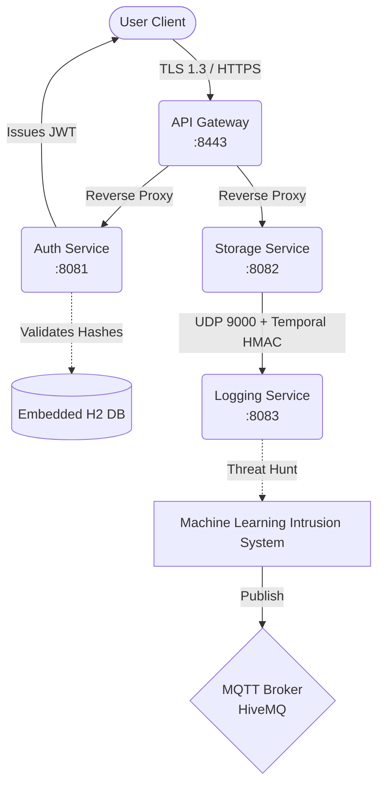

# AuthStore - Secure Microservices File Vault

  

A proof-of-concept, highly concurrent, distributed file storage ecosystem built securely on Java 21, Spring Boot, and Virtual Threads. Designed natively with a strict Zero-Trust security posture, the project leverages stateless Web Tokens (JWT), Temporal Epoch Datagram validation, and real-time AI Machine Learning quarantine capabilities over IoT protocols.

## Architecture



## Security Posture
- Zero-Trust Boundaries: All explicit inter-service and external communication points strictly mandate presentation of an HS256 JWT, verified independently by each service without shared persistence.
- Embedded SSL/TLS 1.3: The entrypoint (API Gateway) automatically decrypts PKCS12 self-signed certificates to execute reverse-proxying.
- Stateless Validation: Total eradication of Server-Side Session caching completely neutralizes all Cross-Site Request Forgery (CSRF) vectors. 
- Distributed Request Correlation: Every external client connecting to the API Gateway is instantly issued a globally unique `X-Trace-Id` UUID. This trace is propagated seamlessly across the internal reverse-proxy network down into the UDP Telemetry stream, providing total lifecycle tracking.
- Deep Binary Malware Inspection: The `VaultAssetController` aggressively sweeps the raw byte streams of incoming uploads for illegal "Magic Signatures". Spotting the `0x4D 5A` hex pattern instantly triggers an execution ban, firmly blocking Windows `.exe` RCE payloads disguised under fake file extensions.
- Advanced Replay Attack Defense: Telemetry emitted by the Storage layer enforces a strict 5000ms TTL (Time-to-Live) temporal validation window alongside HMAC cryptographic hashing to thwart UDP spoofing and network-capture Replay Attack vectors.
- Cryptographic Asset Integrity: The Vault controller dynamically computes a real-time SHA-256 byte hashing digest during ingestion to firmly guarantee upstream data integrity.
- Obfuscated Global Mapping: ControllerAdvice Exception handlers suppress all Whitelabel Error pages to prevent fingerprinting of the internal dependency stack.
- Environment Isolation: Absolutely 0 secrets persist loosely within the byte code or repository index.

## Automated Testing & TDD
The ecosystem is mathematically hardened with **JUnit 5** and **Mockito** validation scripts natively populated across the `src/test/java/` module domains. Extensive mock protocols guarantee the absolute integrity of internal security logic:
- `VaultAssetControllerTest`: Formally intercepts buffer pipelines to strictly prove that illegal `0x4D 5A` executable byte-streams categorically trigger `MALWARE_DETECTED` SecurityExceptions unconditionally.
- `TemporalHmacValidationTest`: Evaluates temporal packet Epoch extraction boundaries against high-velocity simulated UDP spoofing scenarios that violate the `>5000ms` Time-To-Live network survival window.

## How to Run the Application

The ecosystem consists of four independent Spring Boot Microservices. You will need to start all four services concurrently in separate terminal windows. 

### Step 1: Set Environment Variables
Before running any service, you must declare your Vault cryptographic secrets in your terminal session.

If using Windows PowerShell:
```powershell
$env:JWT_SECRET="YWUzZjM4NWQ2NWFiNGI0MmFmMWJjZDI4NDBlOGZiMmExMTA2ZDI5NWIwODI2NjdmYzIyOWI1YTRmNzkyYTQwMQ=="
$env:VAULT_KEYSTORE_PASSWORD="password"
$env:ADMIN_USERNAME="admin"
$env:ADMIN_PASSWORD="admin123"
```

If using Git Bash / Linux / macOS:
```bash
export JWT_SECRET="YWUzZjM4NWQ2NWFiNGI0MmFmMWJjZDI4NDBlOGZiMmExMTA2ZDI5NWIwODI2NjdmYzIyOWI1YTRmNzkyYTQwMQ=="
export VAULT_KEYSTORE_PASSWORD="password"
export ADMIN_USERNAME="admin"
export ADMIN_PASSWORD="admin123"
```

### Step 2: Compile the Parent Project
Initialize the Maven Reactor and compile all dependencies:
```bash
mvn clean compile
```

### Step 3: Boot the Microservices
In four separate terminal windows (with the environment variables set in each), navigate to the root directory and start the services in the following order:

1. Start Logging Service (Ingests Datagrams and hosts ML Intrusion detector)
```bash
mvn spring-boot:run -pl logging-service
```

2. Start Auth Service (H2 Database seeder and JWT Issuer)
```bash
mvn spring-boot:run -pl auth-service
```

3. Start Storage Service (Requires Logging Service UDP socket to be active)
```bash
mvn spring-boot:run -pl storage-service
```

4. Start API Gateway (TLS 1.3 Reverse Proxy)
```bash
mvn spring-boot:run -pl api-gateway
```

### Step 4: Access the Ecosystem
The ecosystem leverages reverse-proxy capabilities. All requests must go through the API Gateway on port `8443`.
- Authenticate: `POST https://localhost:8443/api/auth/login` (Body `{"username": "admin", "password": "admin123"}`)
- Upload Data: `POST https://localhost:8443/api/vault/secure-ingest` (Requires standard `Authorization: Bearer <token>` header and a dummy Multipart File)

## Tech Stack
- Languages: Java 21 
- Frameworks: Spring Boot 3.2.4 (Web, Security, Gateway, Data JPA)
- Protocols: REST (HTTPS), UDP (Datagrams), IoT (MQTT v3)
- Concurrency: Native OS-Virtual Thread Scheduling 
- Security: JJWT, BCrypt, SHA-256, HMAC-SHA256